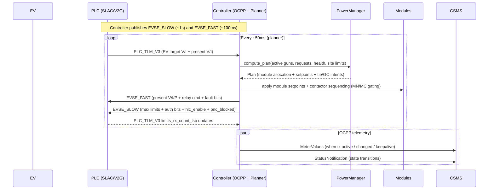
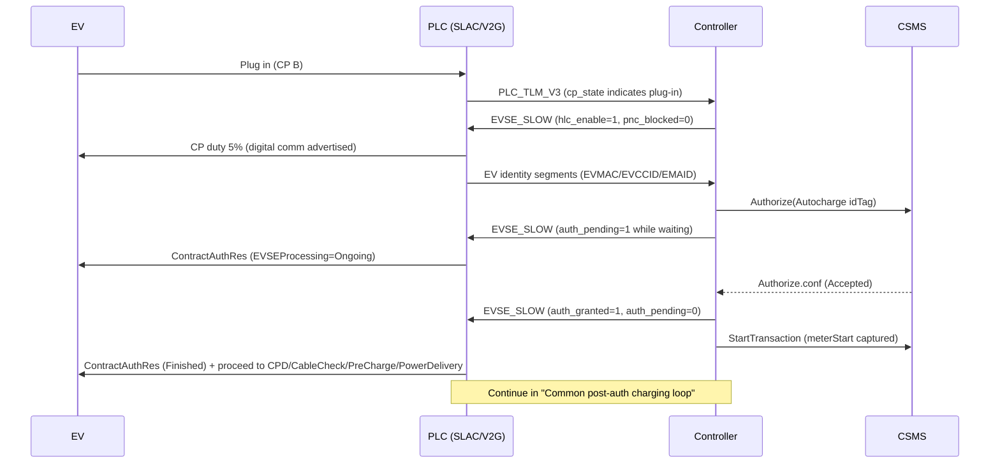
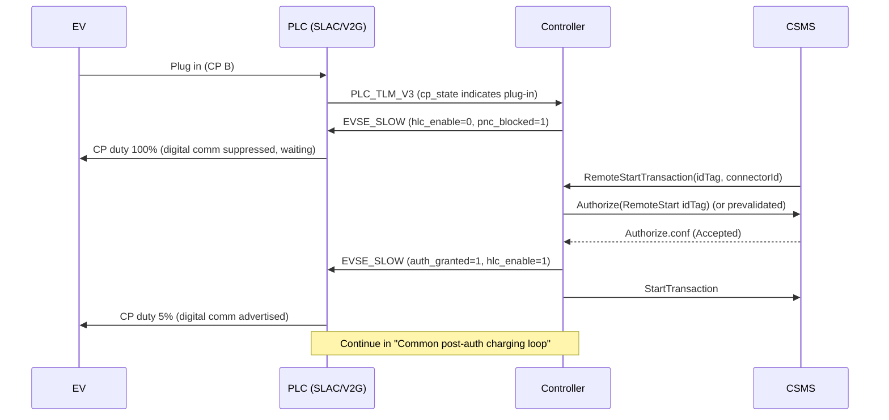
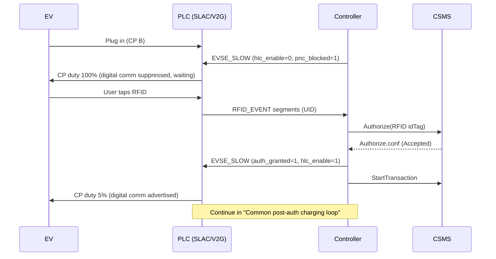

# Joulepoint DC OCPP Controller (PLC/CAN)

This repo contains the DC charger controller that integrates libocpp (OCPP 1.6) with a PLC front-end over SocketCAN. It manages connector state, authorization, sessions, and module power planning for split-charging topologies.

Highlights
- OCPP 1.6 adapter (libocpp submodule, currently pinned to v0.31.1).
- OCPP over TLS (SecurityProfile 2 and 3) with a file-based EVSE security backend (CA bundles + client cert/key).
- `dc_ocpp` runs only with the PLC CAN backend (no simulated hardware path in the current binary).
- Multi-connector support; each connector maps to a PLC node via `plcId`.
- Split charging with KM_A/KM_B tie contactors and module sharing.
- Module CAN drivers: `maxwell-mxr`, `maxwell`, `maxwell-max`, `maxwell-enr`, `enr`, `uugreen`, `uugreenpower`, `tonhe`.
- Single source of truth config in `configs/charger.json` (inline `ocpp` or `ocppConfig` base file).
- CSMS maintenance: async diagnostics/log uploads (GetDiagnostics/GetLog) and firmware updates (UpdateFirmware/SignedUpdateFirmware).

Architecture (high level)
- Vehicle <-> PLC (IEC 61851 / SLAC / ISO 15118 / DIN stack)
- PLC <-> controller over CAN (SocketCAN, 29-bit extended IDs, 125 kbps)
- Controller handles OCPP, authorization, sessions, power planning, and module dispatch
- Power modules talk over CAN (module drivers live in `src/power_module_controller.cpp`)

Quick start
1) Init submodules:
```bash
git submodule update --init --recursive
```
2) Build:
```bash
cmake -S . -B build -DCMAKE_BUILD_TYPE=Release
cmake --build build --target dc_ocpp -j
```
3) Edit `configs/charger.json` (see config section below).
4) Run:
```bash
./build/dc_ocpp -c configs/charger.json
```

Notes
- `dc_ocpp` exits if `chargePoint.usePLC` is false.
- The CAN interface must exist (e.g., `can0`) or the PLC backend will fail to start.
- The shipped `configs/ocpp/v16/config.json` defaults to `SecurityProfile=2` (TLS with server authentication only).
  If you need mTLS, use `configs/ocpp/v16/config-mtls.json` and provision the station client cert/key as described in
  `docs/security_pki.md`.

Build prerequisites
- CMake >= 3.16 and a C++17 compiler
- Boost: log, log_setup, filesystem, thread, regex, date_time
- OpenSSL, libcurl, SQLite3
- libwebsockets

CMake fetches several deps automatically (everest-cmake, everest-log, everest-timer, everest-evse_security, everest-sqlite, nlohmann-json, json-schema-validator, date) when not available locally.

Helper script
```bash
./scripts/build_dc_ocpp.sh
```

Run helpers
- `./scripts/dc_ocpp_run.sh` (uses `DC_OCPP_BIN` and `DC_OCPP_CONFIG` if set)
  - Dev-only: set `DC_OCPP_AUTO_CERTS=1` to autogenerate a local client cert/key when `SecurityProfile=3`.
- `./scripts/install_systemd_service.sh` (Linux systemd unit using `dc_ocpp_run.sh`)

Config reference (charger.json)
Paths are resolved relative to the config file location. The loader creates missing directories and initializes `userConfig` if needed. Values persisted via OCPP ChangeConfiguration are stored in `userConfig` and merged into the base config on startup.

Top-level sections
- `chargePoint`
  - `id`, `vendor`, `model`, `firmwareVersion`
  - `centralSystemURI` or `ocppEndpointToBackend` (the latter overrides ID + URI from the URL path)
  - `usePLC`/`usePlc` (must be true for `dc_ocpp`), `canInterface` (default CAN interface)
  - Optional identity fields: `chargePointSerialNumber`, `meterSerialNumber`, `meterType`, `iccid`, `imsi`, `imei`, `apn`
- `firmwareUpdate`
  - `enabled`, `allowUnsigned` (unsigned updates are disabled by default), `stagingDir`
  - `systemdServiceName`, `targetBinaryPath`, `maxWaitSeconds`
- `controller`
  - `freeMode` (auto-authorize on plug-in)
  - `defaultTag` (token used when `freeMode` is true)
  - `labBypass` (DANGEROUS: bypass certain safety faults; must be false in production)
- `connectors[]`
  - `id` (1..N, unique), `plcId` (0..15, unique; default `id-1`)
  - `label`, `canInterface` (optional override), `maxCurrentA`, `maxPowerW`, `maxVoltageV`, `minVoltageV`
  - `meterSampleIntervalSeconds`, `meterSource` (`plc` | `module` | `shunt`)
  - `meterScale`, `meterOffsetWh`, `requireLock`, `lockInputSwitch` (1..4)
- `plc`
  - `enabled` (defaults true), `useCRC8`
  - `gunRelayOwnedByPlc` (must be false for split charging), `moduleRelaysEnabled` (must be true)
  - `relayMode` (only `ties` is supported), `relayFeedbackAvailable`
  - `autochargeIdSource` (`evmac`, `evccid`, `emaid`)
  - `requireHttpsUploads` (enforces HTTPS for OCPP uploads; PLC backend rejects uploads by default)
- `slots[]` (optional explicit topology; auto-generated if omitted)
  - `id`, `gunId`, `gc`, `mc`, `cw`, `ccw`
  - `modules[]` with per-module metadata
- `planner` / `siteLimits` / top-level planner fields
  - `modulePowerKW`, `gridLimitKW`, `defaultVoltageV`
  - `allowCrossSlotIslands`, `maxModulesPerGun`, `minModulesPerActiveGun`, `maxIslandRadius`
  - `minModuleHoldMs`, `minMcHoldMs`, `minGcHoldMs`
  - `mcOpenCurrentA`, `gcOpenCurrentA`, `tieCloseMaxDeltaV`, `switchMaxCurrentA`, `switchStableTimeMs`
  - `requireAuthForPrecharge` (alias: `blockPrechargeUntilAuthorized`)
  - `prechargeMaxCurrentA` (CCS precharge clamp; default 2 A)
  - `prechargeTimeoutMs`, `prechargeVoltageToleranceV` (default 20 V)
  - `unlockVoltageThresholdV` (default 60 V)
- `timeouts`
  - `authorizationSeconds`, `hlcAuthorizationSeconds` (clamped to 150s), `pncBlockSeconds`
  - `powerRequestSeconds`, `evseLimitAckMs`, `telemetryTimeoutMs`
  - `plcPresentWarnMs`, `plcLimitsWarnMs`
- `uploads`
  - `maxBytes`, `connectTimeoutSeconds`, `transferTimeoutSeconds`, `allowFileTargets`
- `security`
  - `csmsCaBundle`, `mfCaBundle`, `moCaBundle`, `v2gCaBundle`
  - `clientCertDir`, `clientKeyDir`, `seccCertDir`, `seccKeyDir`
- `ocpp` (inline base config) or `ocppConfig` (path to base config JSON)
- `sharePath`, `sqlMigrationsPath`, `databaseDir`, `userConfig`, `messageLogPath`, `loggingConfig`
- `meterSampleIntervalSeconds`, `meterKeepAliveSeconds`, `minimumStatusDurationSeconds`, `moduleHealthGraceMs`

Module config (`slots[].modules[]`)
- `id`, `mn` (module contactor id), `type`
- `canInterface`, `address`, `group`
- Optional vendor fields: `monitorAddress`, `productionDay`, `serialLow`, `sourceAddress`,
  `inputMode`, `hiLoMode`, `silentMode`
- `ratedPowerKW`, `ratedCurrentA`, `pollMs`, `cmdIntervalMs`, `telemetryStaleMs`
- `broadcast`, `probeOnStartup`, `readbackLimits`, `sendOutputCurrent`, `sendOutputPower`

Constraints and defaults
- If `slots` is omitted, a ring is auto-generated from `connectors` order with two modules per slot.
- Each slot supports at most 2 modules in the current implementation.
- `plc.relayMode` must be `ties`, `plc.moduleRelaysEnabled` must be true, and `plc.gunRelayOwnedByPlc` must be false.
- `allowCrossSlotIslands` requires hardware support (`PlcCanHardware` supports this).
- `databaseDir` also stores pending auth tokens at `pending_tokens.json`.
- Autocharge can be toggled at runtime via OCPP ChangeConfiguration key `AutochargeEnabled` (stored under
  `Custom.AutochargeEnabled` in the libocpp JSON config).

PLC/CAN contract
- Authoritative details: `docs/CAN_CONTRACT.md` and `Ref/Basic/docs/CAN_DBC.dbc`.
- Bus: 29-bit extended IDs, 125 kbps, CRC8 on required frames.
- Protocol is fixed at v3; no runtime protocol-version handshake is required.

End-to-end CCS2 DC charging flows (PLC + controller + OCPP + modules)

This section documents the production behavior of the repo as implemented today, cross-referenced to the controller
code (`src/*`) and the reference PLC firmware (`Ref/Basic/*`). If you ship a different PLC stack, validate that its
HLC gate + auth-pending semantics match before relying on these flows.

Actors and ownership
- EV: CP state machine + SLAC + ISO 15118-2 / DIN 70121 behavior.
- PLC (`Ref/Basic/*`): owns CP duty (100% vs 5%), SLAC readiness, ISO/DIN state machine, and HLC stage truth.
- Controller (`src/ocpp_adapter.cpp`): owns OCPP 1.6 state, token ingestion, session/transaction lifecycle, and power planning.
- Modules (`src/power_module_controller.cpp` + drivers): provide power telemetry and accept setpoints.

Key loops and cadence (practically important for "jitter" and false positives)
- Controller metering/auth loop: 50 ms per connector (`OcppAdapter::metering_loop` in `src/ocpp_adapter.cpp`).
- Controller planner loop: 50 ms (`OcppAdapter::apply_power_plan` in `src/ocpp_adapter.cpp`).
- CAN to PLC:
  - EVSE_FAST (present V/I/P + relay cmd + faults): nominal 100 ms.
  - EVSE_SLOW (limits + auth/pending + HLC gate + PnC block): nominal 1 s.
  - See `docs/CAN_CONTRACT.md` for stale thresholds and limits watchdog details.
- PLC HLC authorization-pending timeout: default 150 s (`HLC_MAX_AUTH_PENDING_MS` in `Ref/Basic/src/defs.h`,
  enforced in `Ref/Basic/src/tcp.cpp`).

OCPP message triggers (what sends what, and when)
- StatusNotification:
  - Driven by libocpp’s connector state machine, based on adapter events like `on_enabled()`, `on_disabled()`,
    `on_suspend_charging_ev(se)()`, and `on_resume_charging()` emitted from `update_connector_state()`
    (`src/ocpp_adapter.cpp`).
  - On CSMS connect / boot accepted, the adapter requests a refresh via `trigger_status_notifications()` if the
    libocpp build supports it (see `maybe_refresh_status_notifications()` in `src/ocpp_adapter.cpp`).
- Authorize:
  - Fired when a non-prevalidated token is consumed for a connector (`authorize_id_token()` in `src/ocpp_adapter.cpp`).
- StartTransaction:
  - Fired as soon as `session.authorized && EV connected && !transaction_started` (`src/ocpp_adapter.cpp`).
  - `meterStart` is captured at that moment from `sample_meter()`.
- MeterValues:
  - The controller periodically calls `charge_point_->on_meter_values()` when any of:
    - the transaction is active, or
    - total imported energy changed by >0.1 Wh, or
    - keepalive elapsed (`meterKeepAliveSeconds`).
  - Energy is clamped monotonic to prevent regressions (see `push_meter_values()` in `src/ocpp_adapter.cpp`).
- StopTransaction:
  - Fired when the controller finishes an active transaction (`finish_transaction()` in `src/ocpp_adapter.cpp`).
  - `meterStop` is clamped to be monotonic vs. `meterStart` and previously sent MeterValues (prevents CSMS rejects).
- TriggerMessage:
  - Handled inside libocpp (RemoteTrigger profile). The adapter does not implement a custom TriggerMessage handler;
    it supports status refresh through libocpp’s `trigger_status_notifications()` when available.

Token sources and connector selection
- RFID:
  - PLC emits RFID segments over CAN (`RFID_EVENT`); controller assembles and emits an `AuthTokenSource::RFID`
    token with `connector_hint` set (see `src/plc_can.cpp`).
  - Second tap behavior: if a transaction is already started on that connector and the same token is tapped again,
    it triggers a Local stop, but only after power delivery has begun (relay closed or HLC power-ready) to avoid
    immediate stop-on-double-read noise (`RFID_TAP_LATCH_WINDOW` in `src/ocpp_adapter.cpp`).
- Remote start (app/CSMS):
  - CSMS sends `RemoteStartTransaction`; libocpp invokes `register_provide_token_callback()` which the adapter
    converts to an `AuthTokenSource::RemoteStart` token (`src/ocpp_adapter.cpp`).
  - If CSMS does not specify a `connectorId`, the controller routes the token to the *most recently plugged* connector
    (`select_connector_for_token()` in `src/ocpp_adapter.cpp`). In multi-gun sites this is ambiguous: production
    integrations should include `connectorId`.
- Autocharge (PnC-lite via MAC/EVCCID/EMAID):
  - PLC publishes EV identity over CAN (EVMAC / EVCCID / EMAID segments). The controller emits an
    `AuthTokenSource::Autocharge` token based on `plc.autochargeIdSource` (`src/plc_can.cpp`).
  - Note: OCPP 1.6 idTag is limited to 20 chars. EVMAC (12 hex) and EVCCID (<=16 hex in `Ref/Basic`) are safe.
    If you enable EMAID, confirm the emitted idTag fits 20 chars in your PLC build; otherwise you need a stable
    hashing/mapping scheme agreed with the CSMS.

HLC / digital communication gate (the critical rule)

The controller controls whether the PLC advertises digital comms (5% CP duty) via EVSE_SLOW `hlc_enable`.
In the reference PLC firmware:
- HLC gate: `hlc_gate_active() = g_hlc_enable && !g_force_preauth` (`Ref/Basic/src/main.cpp`).
- CP duty: when `hlc_gate_active()` and CP is connected, PLC advertises digital comms (5%) and runs SLAC/ISO/DIN;
  otherwise it holds CP at 100% and remains in "preauth" (`apply_cp_output()` in `Ref/Basic/src/main.cpp`).
- If `auth_pending` stays true too long while HLC is active, PLC latches an auth-timeout and forces preauth
  (`auth_pending_timeout_reached()` in `Ref/Basic/src/tcp.cpp`).

Production behavior implemented in this repo (`OcppAdapter::apply_hlc_control()` in `src/ocpp_adapter.cpp`):
- If Autocharge is enabled and not blocked: enable HLC/digital comms as soon as the EV is present (plugged/CP-B),
  so the PLC can learn identity early and begin HLC while CSMS authorization is in-flight.
- If Autocharge is disabled, or Autocharge is blocked (reject/timeout): keep HLC/digital comms OFF until explicit
  EIM authorization has succeeded (RFID Accepted or RemoteStart Accepted). This avoids PLC HLC auth-pending timeouts
  and enables a "plug, then wait comfortably in the app" UX.

Common post-auth charging loop (applies to all scenarios once authorized)


Scenarios (Autocharge/MAC vs RemoteStart vs RFID)

1) P&C via MAC (Autocharge) ENABLED and succeeds


2) Autocharge ENABLED, fails (reject/timeout), then user tries RemoteStart
```mermaid
sequenceDiagram
    participant EV
    participant PLC as PLC (SLAC/V2G)
    participant CTRL as Controller
    participant CSMS

    EV->>PLC: Plug in (CP B)
    CTRL->>PLC: EVSE_SLOW (hlc_enable=1, pnc_blocked=0)
    PLC->>CTRL: EV identity segments (EVMAC/EVCCID/EMAID)
    CTRL->>CSMS: Authorize(Autocharge idTag)
    CTRL->>PLC: EVSE_SLOW (auth_pending=1)
    alt CSMS rejects Autocharge
        CSMS-->>CTRL: Authorize.conf (Denied)
    else Controller HLC auth timeout (hlcAuthorizationSeconds)
        CTRL->>CTRL: HLC auth timeout reached
    end
    CTRL->>PLC: EVSE_SLOW (hlc_enable=0, pnc_blocked=1, auth_pending=0, auth_granted=0)
    PLC->>EV: CP duty 100% (digital comm suppressed, preauth)
    Note right of CTRL: Autocharge blocked for TTL; requires EIM fallback

    CSMS->>CTRL: RemoteStartTransaction(idTag, connectorId)
    CTRL->>CSMS: Authorize(RemoteStart idTag) (or prevalidated)
    CSMS-->>CTRL: Authorize.conf (Accepted)
    CTRL->>PLC: EVSE_SLOW (auth_granted=1, hlc_enable=1, pnc_blocked=1)
    CTRL->>CSMS: StartTransaction
    PLC->>EV: CP duty 5% (digital comm advertised)
    Note over PLC,CTRL: Continue in "Common post-auth charging loop"
```

3) Autocharge ENABLED, fails (reject/timeout), then user taps RFID
```mermaid
sequenceDiagram
    participant EV
    participant PLC as PLC (SLAC/V2G)
    participant CTRL as Controller
    participant CSMS

    EV->>PLC: Plug in (CP B)
    CTRL->>PLC: EVSE_SLOW (hlc_enable=1, pnc_blocked=0)
    PLC->>CTRL: EV identity segments (EVMAC/EVCCID/EMAID)
    CTRL->>CSMS: Authorize(Autocharge idTag)
    CTRL->>PLC: EVSE_SLOW (auth_pending=1)
    alt CSMS rejects Autocharge
        CSMS-->>CTRL: Authorize.conf (Denied)
    else Controller HLC auth timeout (hlcAuthorizationSeconds)
        CTRL->>CTRL: HLC auth timeout reached
    end
    CTRL->>PLC: EVSE_SLOW (hlc_enable=0, pnc_blocked=1, auth_pending=0, auth_granted=0)
    PLC->>EV: CP duty 100% (digital comm suppressed, preauth)
    Note right of CTRL: Autocharge blocked for TTL; requires EIM fallback

    EV->>PLC: User taps RFID
    PLC->>CTRL: RFID_EVENT segments (UID)
    CTRL->>CSMS: Authorize(RFID idTag)
    CSMS-->>CTRL: Authorize.conf (Accepted)
    CTRL->>PLC: EVSE_SLOW (auth_granted=1, hlc_enable=1, pnc_blocked=1)
    CTRL->>CSMS: StartTransaction
    PLC->>EV: CP duty 5% (digital comm advertised)
    Note over PLC,CTRL: Continue in "Common post-auth charging loop"
```

4) Autocharge DISABLED, user uses RemoteStart (app)


5) Autocharge DISABLED, user taps RFID


Edge cases and "proper handling" checklist (production readiness)
- RemoteStartTransaction without `connectorId` is ambiguous on multi-connector sites (controller routes to "most recently plugged").
  Recommendation: enforce `connectorId` from CSMS for DC sites or extend routing policy to reject ambiguous remote starts.
- Reservations:
  - ReserveNow is supported; tokens must match the reservation tag/parent tag for that connector.
  - If a connector is reserved and no matching token is present, the controller will not start a session (it will remain pending).
- Autocharge failures:
  - On explicit CSMS rejection or controller-side HLC auth timeout, the controller sets `pnc_blocked` for a TTL and requires EIM.
  - Some EVs may not seamlessly restart SLAC/HLC after a failed contract-auth attempt; if you see interop issues, the site UX may
    need to prompt unplug/replug after Autocharge failure.
- Waiting UX when Autocharge is disabled:
  - Keeping HLC OFF until authorization prevents PLC auth-pending timeouts and avoids "contract auth pending" loops.
  - Make sure `timeouts.authorizationSeconds` (auth wait) is long enough for app-based sessions; otherwise the controller will
    time out the pending session and locally disable the connector.
- Meter values and jitter:
  - If no physical energy meter is present, PLC backend integrates energy from power telemetry; this can drift if telemetry is
    noisy or stale (`sample_meter()` in `src/plc_can.cpp`).
  - Configure a consistent `connectors[].meterSource` (plc/module/shunt) to avoid mismatched V/I/P paths tripping the controller’s
    telemetry sanity checks (`src/ocpp_adapter.cpp`).
- Multiple tokens / dedup:
  - The controller dedups repeated tokens within a short window; RemoteStart bypasses dedup to avoid losing operator retries.
  - RFID double-tap stop is debounced and only becomes actionable after power delivery starts.

Further reading
- PLC/controller runtime contract: `docs/CAN_CONTRACT.md`
- CCS2 DC gap analysis and validation notes: `docs/ccs2_dc_gap_analysis.md`
- Split-charging + module/tie design: `docs/modules/SplitCharging.md`

Raspberry Pi / Docker builds
```bash
./docker/build-rpi.sh
# 32-bit Raspberry Pi OS
PLATFORM=linux/arm/v7 ./docker/build-rpi.sh
```
Artifacts land in `build-rpi/artifacts/bin` and `build-rpi/artifacts/share/`.

Testing
- Planner tests: `cmake --build build --target power_manager_tests -j` then `./build/power_manager_tests`.
- CAN loopback sanity: `./scripts/can_loop_test.sh can0`.

Operational docs
- TLS/PKI provisioning: `docs/security_pki.md`
- Soak testing: `docs/soak_test_plan.md`
- HIL scenarios: `tests/HIL_PLAN.md`
- HIL/Ops validation runbook (TLS + maintenance + CCS2 DC): `docs/hil_validation_runbook.md`

Limitations and notes
- OCPP adapter is 1.6 only (libocpp supports 2.0.1/2.1, but this binary uses v16).
- `dc_ocpp` ships with the PLC CAN backend only. To use custom hardware, implement `HardwareInterface` and update `src/main.cpp`.
- Diagnostics/log uploads and firmware updates are handled asynchronously by the controller (independent of PLC backend).
- OCPP SecurityProfile 2 and 3 are supported (TLS). `DC_OCPP_STUB_SECURITY=1` is dev-only for SecurityProfile 0 and is ignored for TLS profiles.
